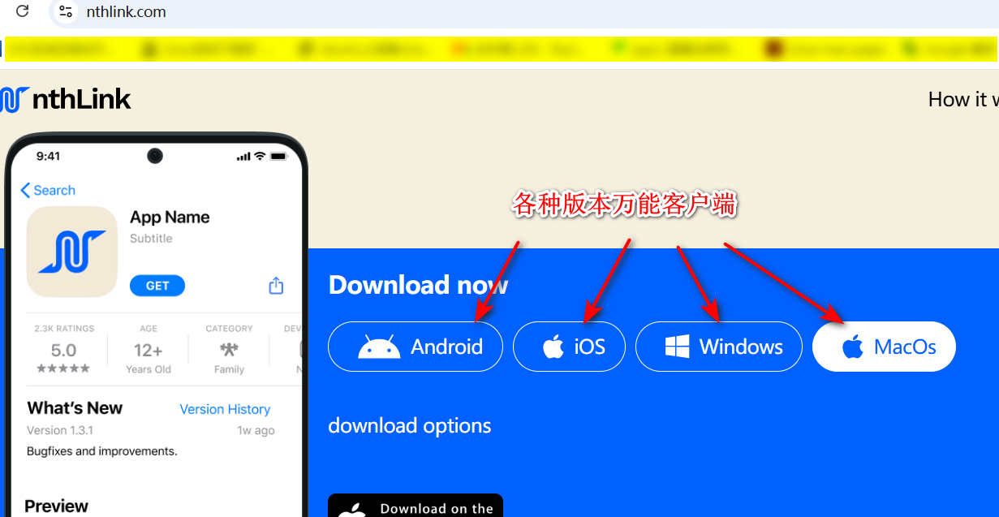
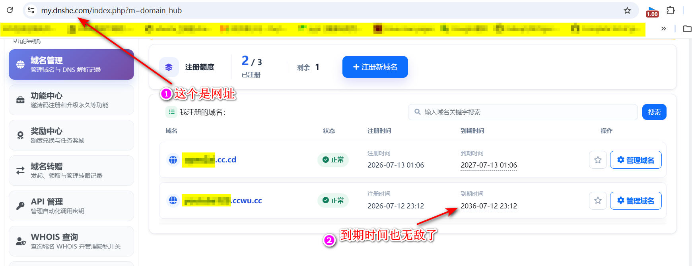
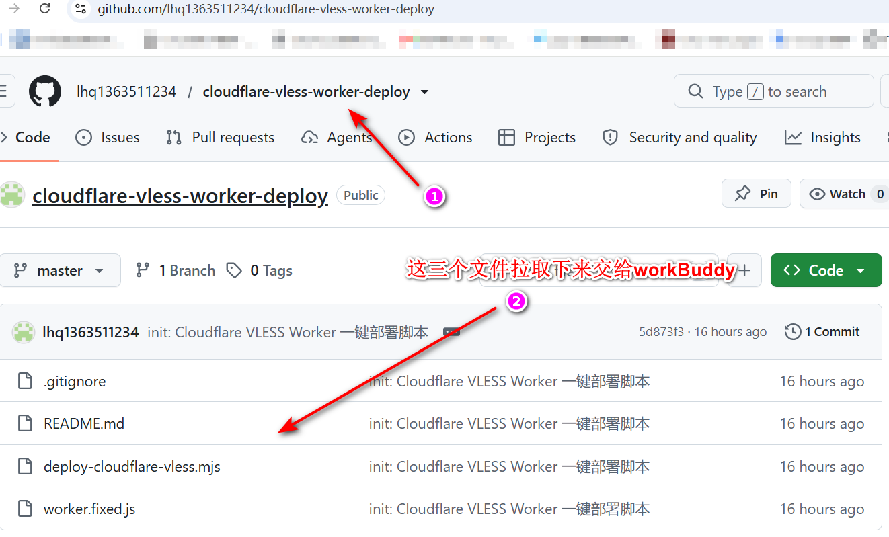
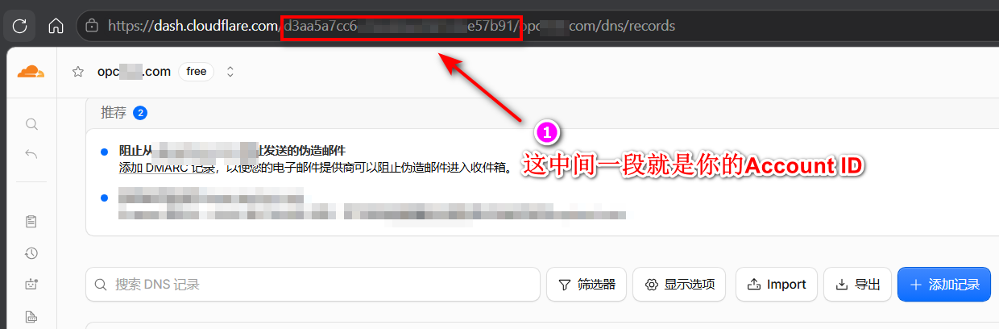
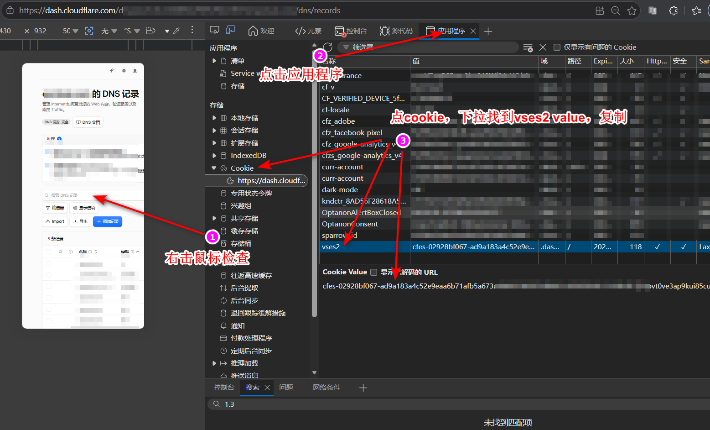
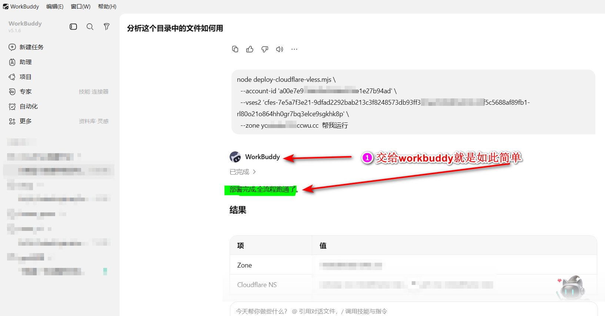

# **【喂饭级教程】2026 终极免费高速访问vpn方案：从 VPS 到 CF 全自动脚本一键部署**

作为资深白嫖党，今天给大家做个**完全免费**的方法

本文有传统的 VPS 玩法，还**有基于 Node.js 的 Cloudflare 纯自动化部署脚本**（无需进 CF 后台点鼠标，一行命令跑通）。

**① 免费探针鸡**

VPS + `fscarmen 一键脚本` (Reality)
免费（著名的google300刀）

看 VPS 线路
中（怕被墙）
有免费小鸡、想独享资源的佬友。

**② CF 大善人**
Cloudflare Workers + **自动部署脚本**
几块钱买个域名（或白嫖）
高（优选 IP 起飞）
极高
**强烈推荐！** 追求极致白嫖、不想管服务器死活的佬友。

**③ 应急大厂羊毛**
Cloudflare WARP / ProtonVPN / nthlink /lantern



费用`0`
一般
凑合
临时救急、只在手机端轻度使用的人。

## **方案一：免费小鸡 (VPS) + 一键傻瓜脚本**

甲骨文、谷歌云、各种云（Oracle Cloud:visa申请可以去YouTube搜索如何免费注册）（ 踩的坑多了，自然就知道怎么免费注册visa了）

不用手写 config，直接用大佬的脚本。

**操作步骤（一条命令）：**

SSH 连上你的机器，跑 fscarmen 大佬的脚本：

```bash
bash <(curl -fsSL https://raw.githubusercontent.com/fscarmen/sing-box/main/sing-box.sh)
```

**提示**

1. 菜单选 **安装 sing-box**。
2. 协议必须选 **VLESS-Reality**（目前最稳，连域名都省了）
3. 端口无脑 443，伪装域名脚本会自动找
4. 跑完后屏幕会输出一长串 `vless://..`，直接复制丢进 v2rayN 或 Clash 就能用

## **方案二：CF 大善人 + 全自动脚本部署（本帖高光）**

这套方案**不需要你有一台服务器**。只要搞个域名交给 Cloudflare，剩下的全是白嫖。

不要再用传统的“进控制台建 Worker → 复制代码 → 绑域名”的复杂步骤，**作为 Linux Do 的佬友，我们必须用命令行自动解决！**

### **1. 准备工作**

- 去 `https://my.dnshe.com/` 白嫖个免费域名。



- 电脑上装好 `Node.js`。
- 下载社区的自动化神级脚本：`deploy-cloudflare-vless.mjs` 和配套源码 `worker.fixed.js`。（代码各位可以自行去 GitHub 搜，或者自己写个简单的 API 调用）。
- 找不到用这[GitHub仓库node脚本](https://github.com/lhq1363511234/cloudflare-vless-worker-deploy)，再不会直接用目前最火workbuddy，以上所有内容都可以发给它他给你部署操作，**除了方案三**



### **2. 获取 CF 的必要字符串  [这里可以参考这位佬友，其中github脚本也来自这位佬友](https://linux.do/t/topic/2401836)**

登录 Cloudflare 网页后台，按 `F12` 打开开发者工具：

1. 拿到你的 **Account ID**（URL 里的那一长串字符）。



1. 在 Application/Storage 的 Cookies 里，找到名为 **`vses2`** 的 Cookie 值并复制。



### **3. 一键起飞**

#### **3.1 不用脚本的佬可以参考类似 GitHub 搜索开源项目 `edgetunnel` 及其衍生版本**

- **BPB-Worker-Panel**（推荐）：一个可视化面板 Worker。部署后打开它的网页，填好域名、UUID、传输方式，面板自动生成订阅链接 + 二维码，还能改配置步骤也简单。
- **EDGETunnel**：单文件 Worker 脚本（VLESS / Trojan），部署即用，输出 Clash 订阅。更轻量、配置项少。

#### **3.2 用脚本则在终端里跑下面这行命令：**

```bash
node deploy-cloudflare-vless.mjs \
  --account-id '你的 Cloudflare 账号 ID' \
  --vses2 '你的 vses2 cookie 值' \
  --zone 你的域名
```

*如果报错提示 Cookie 拦截，可以加完整参数：*

**报错就让workbuddy检测修复**



```
--cookie '完整Cookie字符串' --atok 'x-atok值'
```

## **方案三：临时用 / 纯手机党备用**

如果哪天你的小鸡被封了，CF 的域名也炸了（虽然罕见），白嫖 App ：

1. **Cloudflare WARP (1.1.1.1)**：客户端一键连。如果你有 CF 账号开通了 Zero Trust，无限制高速流量随便用。
2. **ProtonVPN**：永久免费层不限流量。速度虽然限了，但极度抗封锁。
3. **nthlink**
   - **特点**：主打“一键就能用”（Windows / macOS / 安卓端），没有任何复杂的配置。
   - **适用**：不限速，节点少，高峰期（晚上 8-11 点）比较拥挤。
4. **Lantern (蓝灯)**
   - **特点**：老牌免费客户端，注册后能免费使用一定额度。
   - **适用**：免费层有流量和速度限制，且部分节点 IP 经常被针对性封锁，作为备用。

> **附赠：0 成本注册美区 Apple ID 下载这些 App**
>
> 浏览器打开https://www.icloud.com.cn/ ，地区选**美国**，手机号**直接填你的 +86 手机号**（可以正常收验证码！）。注册好后，去 App Store 登录。

最后，所有免费资源随时可能被大厂回收/调整策略。

**觉得有用的佬友，点赞/收藏支持一下！有问题评论区见，知无不言！**

---

## 网页版一键部署（本项目附带的 Web UI）

不想敲命令？本项目自带一个**零依赖**的网页部署工具，把上面的 `node deploy-cloudflare-vless.mjs ...` 封装成了表单页面：填 Account ID / 域名 / Cookie，点「部署」，页面实时滚动显示进度，结束直接给订阅地址和复制按钮。

**运行（任意装了 Node.js 的机器，包括手机 Termux）：**

```bash
# Termux 先装 Node（不需要 git）
pkg install node

# 下载仓库：浏览器打开下面的链接，点「Download ZIP」
# https://github.com/lhq1363511234/cloudflare-vless-worker-deploy

# 解压后进入目录
cd cloudflare-vless-worker-deploy

# 启动（默认端口 3456，可用 PORT 环境变量改）
node web/server.mjs
```

启动后浏览器打开：

- 本机：`http://127.0.0.1:3456`
- 手机 Termux 同局域网其他设备：`http://192.168.x.x:3456`（用 `ifconfig` 看手机局域网 IP）

**功能（三个方案合一的部署台）：**

- **方案二 · CF 一键部署**：表单填 Cloudflare 信息，实时进度（0/7 → 7/7），完事给订阅地址。无需自有服务器。
- **方案一 · VPS 脚本**：
  - ① 生成安装脚本：选协议（VLESS+Reality 推荐 / WS+TLS / Trojan）、端口、伪装域名，一键生成**非交互**的 sing-box 安装 bash 脚本，复制去 VPS 跑即可。
  - ② SSH 一键部署：填 VPS 主机/端口/用户/密码，后端经 `sshpass` 把脚本传到远端直装，实时回传日志并抽取 `vless://` 分享链接。
  - ③ 懒人法：直接给出 fscarmen 社区一键脚本（交互式菜单）。
- **方案三 · 免费软件**：nthlink / Lantern / Cloudflare WARP / ProtonVPN 下载卡片 + 美区 Apple ID 注册指南。

**文件结构：**

```
lib/deploy.mjs              # 方案二部署核心（可调用，去掉了 process.exit，日志注入式）
lib/gen-command.mjs         # 方案一安装脚本生成器（纯函数：buildInstaller / buildFscarmenCommand / extractVlessLink）
lib/ssh-deploy.mjs          # 方案一 SSH 远程执行（sshpass + ssh，流式回传）
web/server.mjs              # 零依赖 Node 服务：/api/deploy、/api/gen-command、/api/ssh-deploy
web/public/                 # 前端：index.html / app.js / style.css（三 Tab）
web/test/                   # 纯函数单测（deploy.test.mjs + gen-command.test.mjs，node --test）
deploy-cloudflare-vless.mjs # CLI 壳，复用方案二核心，参数不变
```

> 命令行党依然可以直接 `node deploy-cloudflare-vless.mjs --account-id ... --vses2 ... --zone ...`，行为不变。
> 方案一 SSH 部署依赖远端有 `sshpass` + `openssh`（Termux：`pkg install openssh sshpass`；Debian：`apt install sshpass`）。

## 友情链接

- [Linux.do](https://linux.do)
